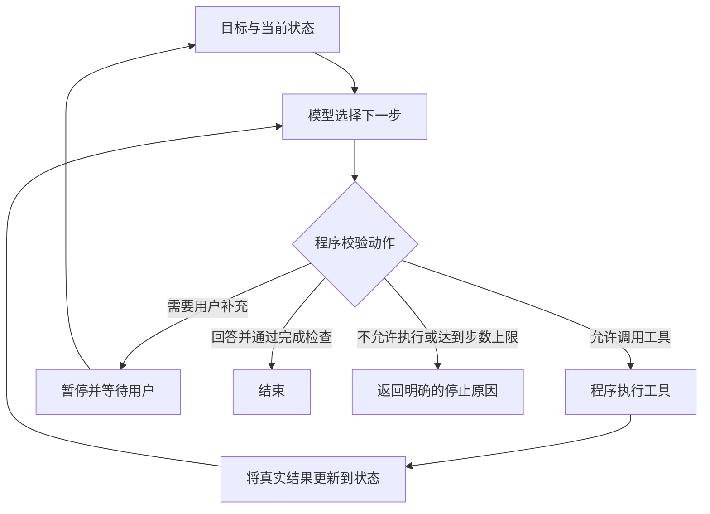

# Session 02：单次模型调用、Workflow 与 Agent

[返回学习计划](../../LEARNING_PLAN.md) · [第一周总笔记](../week1-llm-agent-basics.md) · [上一节](../session_01/README.md)

本节目标：拿到一个需求时，能画出执行过程，说明每一步由代码还是模型决定，并说清任务完成的依据。重点是架构判断，暂不实现完整 Agent 循环。

## 1. 从上一节的代码开始

上一节用代码固定运行 9 次模型请求，再统计文本差异。温度、次数和执行顺序都由 Python 决定，模型只生成每次回答，因此它是固定的实验流程。

**调用次数、是否有 `for` / `while`、是否使用工具，都不能单独作为 Agent 的判定条件。** 本课程关注：模型是否根据任务状态和环境反馈，在程序允许的范围内动态选择后续动作。

课程采用便于实现的区分方式；行业对 Agent 一词的使用并不完全一致。关于预定义工作流与模型动态控制执行过程的区别，可参考 [Anthropic：Building effective agents](https://www.anthropic.com/engineering/building-effective-agents)。

## 2. 用客服场景理解三种方式

下面的订单、政策和执行结果都是教学假设，不代表真实查询或实际业务操作。

### 单次模型调用：让模型完成一个明确任务

任务：将“商品损坏了，我想退货”分类为咨询、投诉或售后。

```text
用户消息 → 代码构造 Prompt → 模型返回类别 → 代码校验类别 → 展示结果
```

模型负责生成分类结果，代码决定调用之后做什么。完成依据是类别符合约定并且分类正确；仅收到一段回答不够。Session 03 会进一步比较 Prompt 和校验方式。

当前项目的一次调用可以这样写，在项目根目录的 Python 环境中执行：

```python
from common.llm import create_llm_client

client = create_llm_client()
response = client.generate(
    "将下面的消息归为咨询、投诉或售后，只输出一个类别：商品损坏了，我想退货。",
    temperature=0.0,
)
print(response.text)
```

这段示例会真实请求配置中的模型，只打印回答；它还没有实现分类校验。运行并观察输出后，才能判断当前样本的表现。

### Workflow：由程序预先规定流程与分支

任务：根据订单和退货规则，生成处理建议。

```text
收到消息
  → 模型提取订单号
  → 代码校验：缺订单号则追问，并等待用户补充
  → 代码查询订单
  → 代码读取对应政策
  → 代码按业务规则判断处理路径
  → 模型将结果组织成回复
  → 代码检查回复后展示
```

其中可以包含多次模型调用、条件分支、工具调用和重试循环；这些机制都不改变“整体路径由程序预定义”这一点。

即使分类模型的输出影响了分支，只要它是在程序规定的几条路径中路由，也可以仍然是工作流。不要把所有包含模型判断的流程都称为 Agent。

完成依据：查询结果有效，处理建议符合政策；查询失败时应报告失败，不能让模型补写一个订单状态。

### Agent：模型根据反馈决定下一步动作

任务：“帮我弄清这个订单为什么不能退货，以及还需要补充什么材料。”

事先允许的动作可以包括：查询订单、查询政策、查看已有售后记录、追问用户、回答并结束。下面是一条**可能的执行轨迹**，不是提前写死的步骤：

| 步骤 | 模型选择 | 程序执行与反馈 |
| --- | --- | --- |
| 1 | 订单号缺失，追问用户 | 暂停并等待真实用户补充 |
| 2 | 查询订单 | 校验参数和访问权限，返回订单状态 |
| 3 | 查询该商品适用的售后政策 | 返回政策内容与来源 |
| 4 | 还缺少拒绝原因，查询售后记录 | 返回“缺少损坏照片”的模拟记录 |
| 5 | 信息足够，解释原因与补充材料 | 核对回答依据，向用户说明并结束 |

如果工具返回“订单不存在”，下一步可能变成核对订单号；如果返回“暂无权限”，就应处理权限限制。后续路径随反馈变化，但可用动作和权限仍由程序约束。



这个图是概念说明，当前 `common/llm.py` 已有文本生成、消息对话、文本流式与非流式工具调用接口，但不负责业务工具执行或 Agent 状态循环。这些会在第 3～4 周完成。

## 3. 模型提出动作，程序负责执行和约束

| 要素 | 本例中的含义 | 主要责任 |
| --- | --- | --- |
| 目标 | 解释不能退货的原因及所需材料 | 应用明确任务范围和完成标准 |
| 工具 | 查询订单、政策和售后记录 | 开发者实现，程序调度执行 |
| 状态 | 已知订单号、查到的事实、尚缺的信息 | 程序维护，再将必要信息提供给模型 |
| 决策 | 下一步查询什么、是否追问或回答 | 模型提出，程序检查 |
| 权限 | 当前用户能否访问该订单 | 程序依据可信身份和授权校验 |
| 反馈 | 工具真实返回的数据、错误或无结果 | 程序提供，不能用模型猜测替代 |
| 停止 | 有依据地回答、等待用户、失败、取消或达到上限 | 程序维护执行边界与最终状态 |

例如模型输出“请调用查询订单工具”，并不会自动查询数据库。还需要程序识别请求、校验参数和权限、执行函数，再把结果送回模型。

同理，模型写出“工单创建成功”不代表真的创建了工单。涉及写入的任务，需要业务接口的执行结果，必要时再查询核实。本节只分析流程，不执行真实业务操作。

## 4. Skill、RAG、记忆和微调处在什么位置

这些概念解决的是不同问题，可以与工作流或 Agent 组合。

| 概念 | 解决的问题 | 客服例子 | 后续学习 |
| --- | --- | --- | --- |
| 工具 | 如何对外查询或执行操作 | 查询订单函数 | 第 3 周 |
| Skill | 如何组织可复用的任务方法与配套资源 | 售后处理步骤、检查项、参考资料 | 第 5 周 |
| RAG | 如何找出本次任务需要的资料并提供给模型 | 检索适用的退货政策 | 第 6 周 |
| 记忆 | 哪些过往信息需要保留并在合适时使用 | 已确认的用户偏好 | 第 7 周 |
| 微调 | 如何用训练数据调整模型参数 | 针对特定任务训练 | 主线后选修 |

Skill 中写有某个操作步骤，不会自动获得执行权限。单独添加工具、检索或记忆，也不足以说明应用已经有模型决策与环境反馈循环。

## 5. 本节练习：先画流程，再说明理由

对下面三个任务分别说明：输入、执行步骤、谁决定下一步、需要的工具、失败怎么办、怎样确认完成。可以直接在对话中作答，不要求保存实验结果文件。

1. **客服分类**：将消息分成咨询、投诉、售后。先考虑一次模型调用是否够用。
2. **固定工单流程**：校验用户填写的字段 → 查询订单 → 按固定规则生成工单草稿 → 人工确认 → 模拟创建 → 查询确认结果。说明哪些条件由代码判断，模型适合参与哪个环节。
3. **多步调研**：在给定的模拟供应商资料中，分析甲、乙两家的方案，识别信息冲突并补查依据。比较预定义检索流程与模型动态选择补查动作的取舍；需要追问时应等待用户，资料不足时应明确说明。

不要只按任务名称分类。同一个“调研”需求既可以实现为工作流，也可以实现为 Agent；必须根据你画出的控制流程判断。

用于检查理解的小题：

> Python 固定执行“调用模型生成回答 → 调用模型检查回答”，最多重复 3 次。检查通过就结束。这个系统只因为有循环和模型反馈，就一定是 Agent 吗？请指出控制流程的代码部分与模型部分。

## 6. 验收与下一节

- [ ] 能解释上一节运行 9 次模型请求，为什么仍是固定实验流程。
- [ ] 能区分预定义分支路由与模型根据反馈动态选择动作。
- [ ] 能说明工具由谁实现、动作由谁执行、权限由谁检查。
- [ ] 能为上述三个练习写出完成依据与失败退出条件。
- [ ] 能说明 Skill、RAG 和记忆分别解决什么问题。

以上是待验收项，学习材料已创建不代表已经掌握。完成后进入 [Session 03：Prompt 结构、Few-shot 与输出校验](../session_03/README.md)。

## 复习补充：前置知识、常见错误与参考答案

前置知识是上一节的函数调用与固定循环；本节不要求独立运行 Agent。上方一次模型调用示例通过公共客户端访问真实服务，本次未重跑。正常架构场景为客服分类；失败边界为无订单、无权限或固定检查持续不通过，应补信息、拒绝或达到上限退出。

常见错误：把调用代码控制的循环理解成“模型不参与决策”；或反过来，只要有模型检查回答就称 Agent。应指出由谁选择动作，程序怎样约束，环境怎样反馈。

<details>
<summary>固定“生成→检查”循环的参考答案</summary>

它属于 Workflow：代码固定两个阶段和停止上限，模型生成内容和检查意见。模型输出影响预设分支并不自动等于模型动态规划；若它能根据反馈选择允许范围内的下一动作，才形成课程中讨论的 Agent 决策循环。工具由程序提供和执行，权限由执行器检查。

</details>

<details>
<summary>三个架构练习的参考思路</summary>

客服分类通常一次调用加校验即可；固定工单流程适合 Workflow，审批和状态核验由程序控制；多步调研可使用固定检索 Workflow，也可让模型根据冲突决定补查，但两者都必须限制范围、预算并验证来源。不要只按任务名称决定架构。

</details>

## 课程导航

[总目录](../../README.md#课程总目录) · [本模块概览](../README.md) · [学习进度](../../LEARNING_PROGRESS.md) · [上一节](../session_01/README.md) · [下一节](../session_03/README.md)
