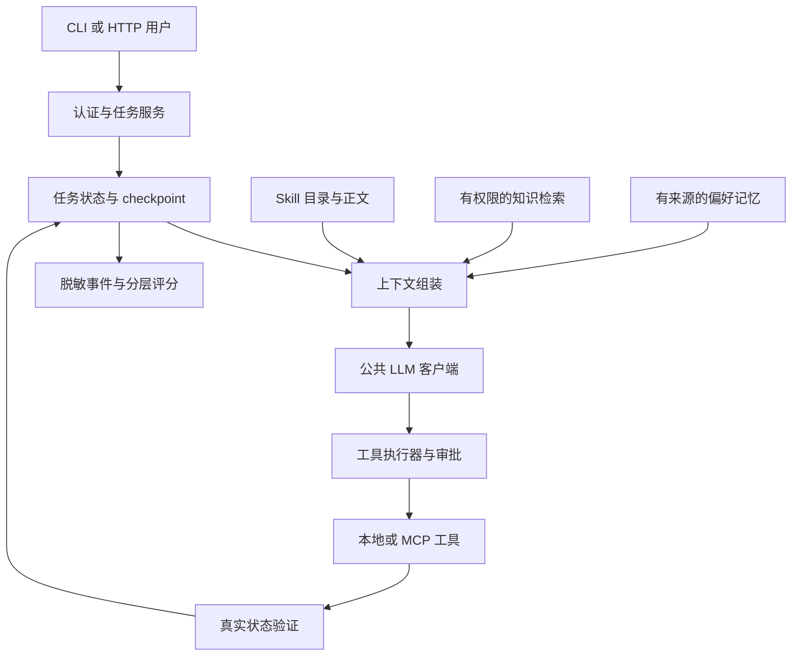

# 第 13 周 Session 01：综合项目需求与验收设计

[总目录](../../README.md#课程总目录) · [本模块概览](../README.md) · [学习进度](../../LEARNING_PROGRESS.md) · [上一节](../../week_12/session_06/README.md) · [下一节](../session_02/README.md)

> 材料已准备；学习状态以[进度记录](../../LEARNING_PROGRESS.md)为准。生成本教案不推进当前学习位置。

## 本节目标

把“知识库客服助手”定义成可验证的任务边界和场景矩阵，先写成功与禁止条件。

## 前置知识与学习安排

前 12 周概念；尚未完成的前置验收应在进度中继续保留。

建议用约 2 小时完成：先理解概念，再运行最小例子，最后做改动实验与验收；原 week 现为模块编号，每模块总时长按实际课时和验收安排。下面的例子自带模拟数据，不依赖其他课尚未创建的模块。

## 核心概念

需求应明确谁能请求、能读哪些资料、有哪些工具、哪些操作要审核、预算多少和怎样证明完成。一个清晰场景是“u1 为 A100 申请退货”：补齐信息、核对归属、检索政策、展示方案、审批、创建并核验工单。

将正常、缺信息、无答案、工具失败、越权和取消分成预先定义的验收例。每例写期望状态与禁止副作用，例如 waiting_user 时不得创建工单，越权不能返回订单详情。测试内容一旦用于开发就不能再称独立保留集。

本节产出是需求与架构，不是集成已经完成。下方可执行需求矩阵检查每个场景是否有明确终态和写入约束；它不测试真正 Agent。实际验收还要运行被测系统、比较观察和期望。

## 最小示例：可离线运行

在项目根目录运行 `uv run python -`，粘贴下面完整代码块，按 Ctrl-D 结束输入并执行；也可按[统一运行方法](../../README.md#文内示例怎么运行)通过标准输入运行。除明确标注依赖顺序的扩展外，每节最小示例独立执行。断言同时覆盖正常与失败或边界路径；输出只在控制台。

```python
# course: offline
from dataclasses import dataclass

@dataclass(frozen=True)
class Case:
    name: str
    user: str
    order_id: str | None
    expected: str
    max_writes: int

cases = [
    Case("approved_return", "u1", "A100", "success", 1),
    Case("missing_order", "u1", None, "waiting_user", 0),
    Case("no_policy", "u1", "A101", "no_answer", 0),
    Case("tool_timeout", "u1", "A100", "unknown", 0),
    Case("cross_user", "u2", "A100", "denied", 0),
    Case("cancelled", "u1", "A100", "cancelled", 0),
]
ALLOWED = {"success", "waiting_user", "no_answer", "unknown", "denied", "cancelled"}

def validate_spec(items):
    if len({c.name for c in items}) != len(items):
        raise ValueError("duplicate_case")
    for c in items:
        if c.expected not in ALLOWED or c.max_writes not in {0, 1}:
            raise ValueError("ambiguous_acceptance")
        if c.expected in {"waiting_user", "no_answer", "denied", "cancelled"} and c.max_writes != 0:
            raise ValueError("unexpected_side_effect")
    return len(items)

assert validate_spec(cases) == 6
for bad in (cases + [cases[0]], [Case("bad", "u1", None, "waiting_user", 1)]):
    try:
        validate_spec(bad)
    except ValueError as exc:
        print("拒绝需求缺陷：", exc)
    else:
        raise AssertionError("验收规范缺陷未发现")
for case in cases:
    print(case)
print("PASS：正常需求矩阵、重复样本和错误副作用约束；未测实际 Agent")
```

**预期现象：**六个场景定义通过；重复 ID 和等待输入时允许写入的规范被拒绝。这是需求检查，不是系统端到端成功。

**验证边界：**上述最小块已于 2026-09-21 实际离线运行。通过只说明这些夹具与断言通过，不证明模型效果、真实服务或用户已经掌握；下方扩展实验须另行记录证据。

### 建议架构与交接契约



接口交接至少包含 `task_id`、`user_context`、`goal_revision`、`action_id`、版本清单和结构化观察。模型输入只取得业务所需字段；可信身份、审批记录和密钥不由模型生成。每个模块能用固定输入单独验证，再接入整体。
## 实验步骤与练习

1. 根据真实目标明确工具范围和不支持的请求，保持模拟订单数据，不接真实客户系统。
2. 为每个场景补齐测试输入、权限、审批、预算、引用和实际状态观察点。
3. 确定开发集与新的保留集，冻结验收规则；保留集不要直接从课件公开示例复制。

## 常见错误

- 需求只有“回答要准确”，无法验收。
- 把任何自然语言请求都纳入支持范围。
- 等实现结束再挑能成功的样本。

## 思考题

为什么先定义禁止副作用，而不是只定义正确回答？

<details>
<summary>参考答案（先自行作答）</summary>

Agent 会改变环境。即使最终文本正确，越权读取或取消后写入也可能已经发生；验收必须覆盖行为边界和真实状态。

</details>

## 验收标准

- [ ] 支持范围与身份边界明确。
- [ ] 至少覆盖六类场景并定义禁止行为。
- [ ] 验收标准在实际实现前固定。

验收须结合你的解释、实际实验或明确反馈；查看参考答案和生成材料不自动勾选。

## 依赖、官方资料与核对日期

核对日期：2026-09-21。离线最小示例：Python 3.12 标准库，无新增依赖；本次在 Python 3.12.0 隔离临时目录执行，禁止网络连接。 本次未调用真实模型或外部服务，未部署。版本用于课程复现，不表示最新推荐版本；未来升级要重新核对接口并运行相应案例。

- [评估方法参考](https://www.anthropic.com/engineering/demystifying-evals-for-ai-agents)

## 下一节衔接

下一节按接口逐项整合，使用故障注入定位问题。

[总目录](../../README.md#课程总目录) · [本模块概览](../README.md) · [学习进度](../../LEARNING_PROGRESS.md) · [上一节](../../week_12/session_06/README.md) · [下一节](../session_02/README.md)
